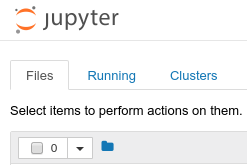

# User Guide for CSS NLP Lab Notebooks

## 0. Getting the Code and Data
To use these labs, you will need to download the code and the data. These are available for free online in two separate GitHub repositories. You **must** download both repositories.

#### Repositories
- **Code** https://github.com/UM-CSS/CSSLabs-NLP
- **Data** https://github.com/rudeboybert/JSE_OkCupid

#### Download a repository from GitHub
- If you are familiar with `git`
    - We recommend you clone each repo.
- If you are unfamiliar with `git`
    - Easiest option:
        - Press the  button on the right side of each repository.
        - Choose `Download ZIP` and save the file somewhere memorable.
        - Go to where the file is saved and unzip it.

#### Putting the data in its place
These labs use data from Journal of Statistical Education Paper on Using OkCupid Data for Data Science Courses. We do not want to host or distribute this data, which is why we asked you to get it from the authors' Github page above. Now you need to put this data somewhere our code can find it. Steps:
1. Open the JSE_OkCupid folder that you downloaded.
2. Unzip the file `profiles.csv.zip`.
3. Copy the unzipped file `profiles.csv`.
4. Open the folder `CSSLabs-NLP`.
5. Within that folder, open the folder `data`.
6. Paste the `profiles.csv` file into the `data` folder. 
    

## 1. Environment Setup
You will need some software to be able to run this code. Advanced users may view the required libraries in the [README](README.md) file. For all users, we recommend the following:
1. Download Anaconda 3.6 version from [this link](https://www.anaconda.com/download/).
    - Anaconda is an "installer" or "package manager" for python. It installs many of the tools, packages, and libraries that are commonly used in python data analysis. It can also be used to install and update additional packages. It is particularly nice because it makes sure that everything works together, which can be hard to do when installing each thing separately. 
2. Install Anaconda on your computer (there are instructions on their website if you have difficulty).
3. Once Anaconda is installed, you should be able to start the programs it includes just like you would start other programs. Test this now:
    - Search for a program called `anaconda navigator` and launch it. When it opens, you should see the option to launch `jupyter notebook`.
        - Alternatively, you can often search for `jupyter notebook` and launch that directly 
    - When jupyter launches, two things will happen:
        1. A terminal / command prompt will open. Do not close this: jupyter is running your code here. You can safely ignore it.
        2. A new tab or window should open in your browser with something like this: 
            -  
            - If you see this, congradulations: you have successfully installed everything you need. If not, there is something wrong with your installation.
4. In the jupyter notebook tab, you should see a list of files and folders on your computer. Navigate through these folders to the `CSSLabs-NLP` folder.
    - **Note** if you do not see this folder, it may be that you saved it somewhere jupyter cannot get to. The easiest solution is co move it to somewhere jupyter can see, such as "my documents." 
5. In this folder is a list of labs, each ending in `.ipynb`. Click any of these and they should open in a new tab with the lab code and instructions.
    - **Note** if you get an error or the top of the new page does not look like this 
        - , 
        - Then you have probably made a mistake in downloading the files. Go back to the "clone or download" instructions above. 
6. If you are new to Jupyter Notebooks, everything you need for these labs is in the great [introduction to their basic use](http://nbviewer.jupyter.org/github/jupyter/notebook/blob/master/docs/source/examples/Notebook/Notebook%20Basics.ipynb).

## 2. Using Lab Exercises
**Note** Labs 2 and 3 require you to first run the code in Lab 1. You may simply run the code in Lab 1 without looking at it and skip to labs 2 or 3 if you like. (Be sure to check for errors when you run Lab 1: if there is something wrong with your setup, it will show up here. Lab 1 has detailed instructions for common errors.)

### Short Summaries of each Lab
- Lab 0 introduces both the python programming language and how computers think about text. It assumes no prior knowledge of programming, and does not require outside data. It is not a comprehensive course in either programming or text processing, but rather a quick, gentile start designed to help new users up and running with the basics.
- Lab 1 walks students through cleaning the OKC profile data. Data are often messy when researchers first get them; indeed munging is usually the largest component of any data science project.
- Lab 2 gets students thinking about text as data. By the end, students compare word frequencies across different social groups to see what aspects of their language use are distinctive.
- Lab 3 introduces students to topic modeling. They construct topic models, interpret the topics, evaluate their quality, and explore the relative popularity of topics across social groups.

### Lab 0: Intro to python & text

### Lab 1: Data munging

### Lab 2: Word frequencies
#### Initial Setup
- This lab uses the `clean_profiles.tsv` file produced by `Lab 1`. You will need to run that code first, or get a copy of the file it creates from someone who has. 
    - If you get an error that says something like `FileNotFoundError: File b'data/clean_profiles.tsv' does not exist` at the bottom, if means that you need to run the code in Lab 1. If you already ran this code and still get this error, then check for error messages in Lab 1. 
- If you have run this lab or used `nltk` before, you should comment out the `nltk.download()` line in the imports code.
- If you are running this code on a personal computer or laptop:
    - Run the code under the header "For laptop and personal computer users." 
    - This takes a smaller sample of the data. Otherwise, the data is too big for most personal computers and causes them to crash. 

#### Helper functions
- This lab, like the others, has code labeled "helper functions." 
- This code is not explained in the notebook because it is not a central part of the lesson.
- Students should run these code cells and scroll past them without worrying about how they work. 

#### Stop words
- This lab changes the standard English set of stop words so that pronouns are not removed from the text. This decision was informed by the work of James Pennebaker and others, which shows that pronoun frequency can be very informative.
- It turns out that pronoun frequencies aren't very distinctive of different groups within this data set. We would see similar results if we used the default list of stop words and excluded pronouns. 
- The lab still does not use the default set of stop words in order to show students more about what stop words are and that they should not be used uncritically. 

#### Cleaning text
- There is a lis of `bad_words` in the text cleaning function. This is a bit of a hack solution to the fact that `beautifulsoup`, although it is a great HTML parsing library, does not quite remove all links from our text. Without this, the words `http` and `www` clutter the results. `\nnan` is removed also, because every empty text box leaves that artifact.

#### Sex/gender 
- The OKC data has a column `sex` with categories `m` and `f`. There is no column or category to indicate gender identity or intersex identity. 
- The lab generally refers to these groups as "men" and "women." This is likely how most people interacted with the site when making their profiles. It is also how most students will interpret the sex data. It is not perfect. 
- If students raise the problems with this data, it is a great opportunity to pose to them research questions: 
    - Given that OkCupid has constraining options, how might trans, genderqueer, and enby people interact with it?
    - Do words like `transgender` appear in the profile text? (yes)
        - What sex do those individuals pick, and how does it relate to what they write in their profiles? (it depends)

### Lab 3: Topic Modeling

